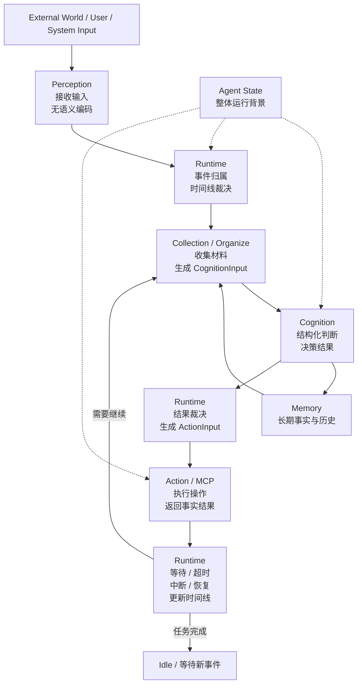

# General Agent Execution Loop

```mermaid

flowchart TD
A[External World / User / System Input]

    A --> P[Perception<br/>接收输入<br/>无语义编码]

    P --> R1[Runtime<br/>事件归属<br/>时间线裁决]

    R1 --> COL[Collection / Organize<br/>收集材料<br/>生成 CognitionInput]

    COL --> C[Cognition<br/>结构化判断<br/>决策结果]

    %% Memory side-channel
    M[Memory<br/>长期事实与历史] --> COL
    C --> M

    C --> R2[Runtime<br/>结果裁决<br/>生成 ActionInput]

    R2 --> A1[Action / MCP<br/>执行操作<br/>返回事实结果]

    A1 --> R3[Runtime<br/>等待 / 超时<br/>中断 / 恢复<br/>更新时间线]

    R3 -->|需要继续| COL
    R3 -->|任务完成| END[Idle / 等待新事件]

    AS[Agent State<br/>整体运行背景] -.-> C
    AS -.-> R1
    AS -.-> A1
```
