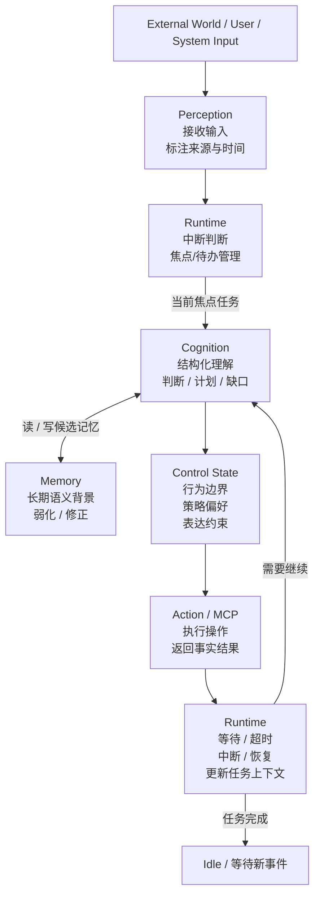

# General Agent Execution Loop

```mermaid

flowchart TD
A[External World / User / System Input]

    A --> P[Perception<br/>接收输入<br/>标注来源与时间]

    P --> R1[Runtime<br/>中断判断<br/>焦点/待办管理]

    R1 -->|当前焦点任务| C[Cognition<br/>结构化理解<br/>判断 / 计划 / 缺口]

    %% Memory is side-channel
    C <-->|读 / 写候选记忆| M[Memory<br/>长期语义背景<br/>弱化 / 修正]

    C --> CS[Control State<br/>行为边界<br/>策略偏好<br/>表达约束]

    CS --> A1[Action / MCP<br/>执行操作<br/>返回事实结果]

    A1 --> R2[Runtime<br/>等待 / 超时<br/>中断 / 恢复<br/>更新任务上下文]

    R2 -->|需要继续| C
    R2 -->|任务完成| END[Idle / 等待新事件]
```
